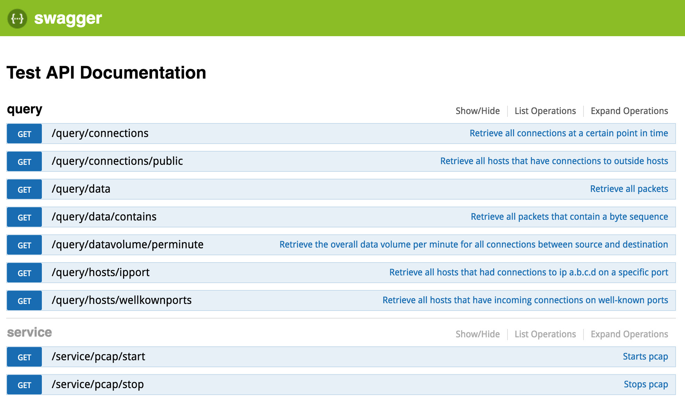

# Redis Pcap Monitor
Pcap sniffed data stored in redis and accessed via REST with swagger gui



## Usage
You will need `libpcap` installed. Most OSX machines seem to have it. All major Linux distributions have it available either by default or with a package like `libpcap-dev`.

Used docker container: https://hub.docker.com/_/redis/

```
$ docker run --name some-redis -p=6379:6379 -d redis
$ npm i
$ sudo npm start
```

Go to http://localhost:3000/documentation for swagger gui.
